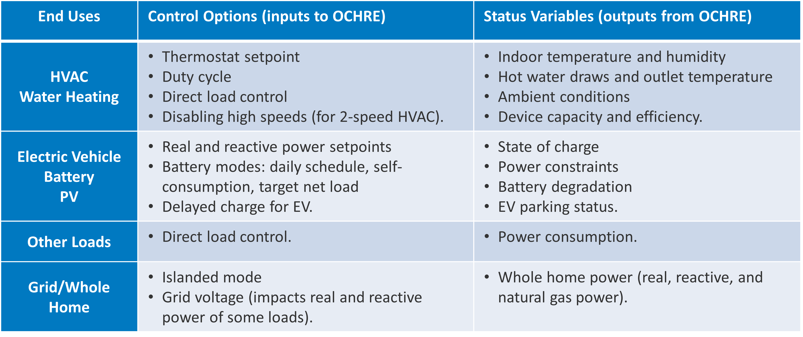

.. _controllers:

Controller Integration
======================

While OCHRE can simulate a stand-alone dwelling or piece of equipment, it is
designed to integrate with external controllers and other modeling tools.
External controllers can adjust the power consumption of any OCHRE equipment
using multiple control methods. OCHRE can also send status variables to
controllers to enable more advanced control strategies. The following table
provides an overview of the control signals and status various that OCHRE can
send and receive.

  Overview of OCHRE control options and status variables

For example, the code below will create a battery model and discharge it at 5
kW for one time step.

.. code-block:: python

    battery = Battery(
        capacity_kwh=10,  # energy capacity = 10 kWh
        capacity=5,       # power capacity = 5 kW
        soc_init=0.5,     # Initial SOC = 50%
        start_time=dt.datetime(2018, 1, 1, 0, 0),
        time_res=dt.timedelta(minutes=15),
        duration=dt.timedelta(days=1),
    )
    
    control_signal = {'P Setpoint': -5}      # Discharge at 5 kW
    status = battery.update(control_signal)  # Run for 1 time step

See the `OCHRE User Tutorial
<https://colab.research.google.com/github/NREL/OCHRE/blob/main/notebook/user_tutorial.ipynb>`__
Jupyter notebook or `run_external_control.py
<https://github.com/NREL/OCHRE/blob/main/bin/run_external_control.py>`__ for
example code for multiple end uses.

Equipment Control Signals
-------------------------

The following tables list the control signals that OCHRE equipment can
receive, by end use. They include the unit of each control signal, and whether
the control signal resets at the end of the time step.

HVAC Heating or HVAC Cooling
~~~~~~~~~~~~~~~~~~~~~~~~~~~~

+--------------------------+----------+---------------------+-------------------------------------------------------------------------------+
| Control Command          | Units    | Resets?             | Description                                                                   |
+==========================+==========+=====================+===============================================================================+
| Load Fraction            | unitless | True                | 1 (no effect) or 0 (forces equipment off)                                     |
+--------------------------+----------+---------------------+-------------------------------------------------------------------------------+
| Setpoint                 | C        | True                | Sets temperature setpoint                                                     |
+--------------------------+----------+---------------------+-------------------------------------------------------------------------------+
| Deadband                 | C        | Only if in schedule | Sets temperature deadband                                                     |
+--------------------------+----------+---------------------+-------------------------------------------------------------------------------+
| Capacity                 | W        | True                | Sets HVAC capacity directly, ideal capacity mode only                         |
+--------------------------+----------+---------------------+-------------------------------------------------------------------------------+
| Max Capacity Fraction    | unitless | Only if in schedule | Limits HVAC max capacity, ideal capacity mode only                            |
+--------------------------+----------+---------------------+-------------------------------------------------------------------------------+
| Disable Speed X          | N/A      | False               | Flag to disable low (X=1) or high (X=2) speed, only for 2 speed equipment     |
+--------------------------+----------+---------------------+-------------------------------------------------------------------------------+
| ER Capacity              | W        | True                | Sets ER element capacity directly, ideal capacity mode only, ASHP Heater only |
+--------------------------+----------+---------------------+-------------------------------------------------------------------------------+
| Max ER Capacity Fraction | unitless | Only if in schedule | Limits ER element max capacity, ideal capacity mode only, ASHP Heater only    |
+--------------------------+----------+---------------------+-------------------------------------------------------------------------------+

Water Heating
~~~~~~~~~~~~~

+-----------------+----------+---------------------+-----------------------------------------------------------+
| Control Command | Units    | Resets?             | Description                                               |
+=================+==========+=====================+===========================================================+
| Load Fraction   | unitless | True                | 1 (no effect) or 0 (forces equipment off)                 |
+-----------------+----------+---------------------+-----------------------------------------------------------+
| Setpoint        | C        | Only if in schedule | Sets temperature setpoint [#]_                            |
+-----------------+----------+---------------------+-----------------------------------------------------------+
| Deadband        | C        | Only if in schedule | Sets temperature deadband [#]_                            |
+-----------------+----------+---------------------+-----------------------------------------------------------+
| Max Power       | kW       | Only if in schedule | Sets the maximum power. Does not work for HPWH in HP mode |
+-----------------+----------+---------------------+-----------------------------------------------------------+

.. [#] A 10 F (5.56 C) decrease in setpoint corresponds to a CTA-2045 'Load
    Shed' command. A 10 F increase corresponds to an 'Advanced Load Add'
    command (only available in B version of standard).
.. [#] Decreasing the deadband to about 2 C corresponds to a CTA-2045 'Load
    Add' command. A typical deadband for gas and electric water heaters is 10
    F (5.56 C).

Electric Vehicle (EV)
~~~~~~~~~~~~~~~~~~~~~

+-----------------+----------+---------------------+---------------------------------------------------------------------------------------+
| Control Command | Units    | Resets?             | Description                                                                           |
+=================+==========+=====================+=======================================================================================+
| Delay           | N/A      | True                | Delays EV charge for a given time [#]_                                                |
+-----------------+----------+---------------------+---------------------------------------------------------------------------------------+
| P Setpoint      | kW       | True                | Sets the AC power setpoint                                                            |
+-----------------+----------+---------------------+---------------------------------------------------------------------------------------+
| SOC             | unitless | True                | Sets the AC power to achieve desired SOC setpoint                                     |
+-----------------+----------+---------------------+---------------------------------------------------------------------------------------+
| SOC Rate        | 1/hour   | True                | Sets the AC power setpoint based on SOC rate, EV capacity, and efficiency of charging |
+-----------------+----------+---------------------+---------------------------------------------------------------------------------------+
| Max Power       | kW       | Only if in schedule | Maximum power limit                                                                   |
+-----------------+----------+---------------------+---------------------------------------------------------------------------------------+
| Max SOC         | unitless | Only if in schedule | Maximum SOC limit                                                                     |
+-----------------+----------+---------------------+---------------------------------------------------------------------------------------+

.. [#] Value can be a ``datetime.timedelta`` or an integer to specify the
    number of time steps to delay

Solar PV
~~~~~~~~

+--------------------+----------+---------+------------------------------------------------------------------------------------+
| Control Command    | Units    | Resets? | Description                                                                        |
+====================+==========+=========+====================================================================================+
| P Setpoint         | kW       | True    | Sets real AC power setpoint                                                        |
+--------------------+----------+---------+------------------------------------------------------------------------------------+
| P Curtailment (kW) | kW       | True    | Sets real power setpoint by specifying absolute curtailment                        |
+--------------------+----------+---------+------------------------------------------------------------------------------------+
| P Curtailment (%)  | %        | True    | Sets real power setpoint by specifying curtailment relative to maximum power point |
+--------------------+----------+---------+------------------------------------------------------------------------------------+
| Q Setpoint         | kVAR     | True    | Sets reactive power setpoint                                                       |
+--------------------+----------+---------+------------------------------------------------------------------------------------+
| Power Factor       | unitless | True    | Sets reactive power setpoint based on power factor                                 |
+--------------------+----------+---------+------------------------------------------------------------------------------------+
| Priority           | N/A      | False   | Changes internal controller priority setting [#]_                                  |
+--------------------+----------+---------+------------------------------------------------------------------------------------+

.. [#] Options include 'Watt' for Watt-priority, 'Var' for VAR-priority, or
    'CPF' for constant power factor mode 

Battery
~~~~~~~

+-----------------------+----------+---------------------+-------------------------------------------------------------+
| Control Command       | Units    | Resets?             | Description                                                 |
+=======================+==========+=====================+=============================================================+
| P Setpoint            | kW       | True                | Sets AC power setpoint                                      |
+-----------------------+----------+---------------------+-------------------------------------------------------------+
| SOC                   | unitless | True                | Sets AC power to achieve desired SOC setpoint               |
+-----------------------+----------+---------------------+-------------------------------------------------------------+
| Self Consumption Mode | N/A      | False               | Flag to turn on Self-Consumption Mode [#]_                  |
+-----------------------+----------+---------------------+-------------------------------------------------------------+
| Min SOC               | unitless | Only if in schedule | Minimum SOC limit, self-consumption control only            |
+-----------------------+----------+---------------------+-------------------------------------------------------------+
| Max SOC               | unitless | Only if in schedule | Maximum SOC limit, self-consumption control only            |
+-----------------------+----------+---------------------+-------------------------------------------------------------+
| Max Import Limit      | kW       | Only if in schedule | Max dwelling import power for self-consumption control [#]_ |
+-----------------------+----------+---------------------+-------------------------------------------------------------+
| Max Export Limit      | kW       | Only if in schedule | Max dwelling export power for self-consumption control [#]_ |
+-----------------------+----------+---------------------+-------------------------------------------------------------+

.. [#] Self-Consumption Mode aims to minimize grid imports and exports. This
    strategy will charge the battery when net energy generation is larger than
    the Max Export Limit and discharge when net energy consumption is larger
    than the Max Import Limit.
.. [#] Can be negative to force the battery to discharge to the grid
.. [#] Can be negative to force the battery to charge from the grid (or from
    gross solar generation)

Gas Generator
~~~~~~~~~~~~~

+-----------------------+-------+---------------------+-------------------------------------------------------------+
| Control Command       | Units | Resets?             | Description                                                 |
+=======================+=======+=====================+=============================================================+
| P Setpoint            | kW    | True                | Sets AC power setpoint                                      |
+-----------------------+-------+---------------------+-------------------------------------------------------------+
| Self Consumption Mode | N/A   | False               | Flag to turn on Self-Consumption Mode [#]_                  |
+-----------------------+-------+---------------------+-------------------------------------------------------------+
| Max Import Limit      | kW    | Only if in schedule | Max dwelling import power for self-consumption control [#]_ |
+-----------------------+-------+---------------------+-------------------------------------------------------------+

.. [#] Self-Consumption Mode aims to minimize grid imports. This strategy will
    generate electricity when net energy consumption is larger than the Max
    Import Limit.
.. [#] Can be negative to force excess generation to the grid

Lighting and Other Loads
~~~~~~~~~~~~~~~~~~~~~~~~

+-----------------+-------------+---------+------------------------------------------------------------------------------------------+
| Control Command | Units       | Resets? | Description                                                                              |
+=================+=============+=========+==========================================================================================+
| Load Fraction   | unitless    | True    | Multiplier to adjusts the scheduled power consumption. Applied to electric and gas power |
+-----------------+-------------+---------+------------------------------------------------------------------------------------------+
| P Setpoint      | kW          | True    | Sets electric power setpoint                                                             |
+-----------------+-------------+---------+------------------------------------------------------------------------------------------+
| Gas Setpoint    | therms/hour | True    | Sets gas power setpoint                                                                  |
+-----------------+-------------+---------+------------------------------------------------------------------------------------------+

External Model Signals
----------------------

OCHRE can also integrate with external models that modify default schedule
values and other settings.

The most common use case is to integrate with a grid simulator that modifies
the dwelling voltage. OCHRE includes a voltage-dependent
impedance-current-power (ZIP) model for all equipment that modifies the real
and reactive electric power based on the grid voltage.

The following code sends a voltage of 0.97 p.u. to a Dwelling model:

.. code-block:: python

    status = dwelling.update(schedule_inputs={'Voltage (-)': 0.97})

External model signals can also modify any time series schedule values
including weather and occupancy variables. The names and units of these
variables can be found in the header of the :ref:`OCHRE schedule file
<output-files>`. Alternatively, these variables can be set at the beginning of
the simulation; see the `OCHRE User Tutorial
<https://colab.research.google.com/github/NREL/OCHRE/blob/main/notebook/user_tutorial.ipynb>`__
Jupyter notebook for more details.

Status Variables
----------------

The ``update`` function for equipment and dwellings returns a Python
dictionary with status variables that can be sent to the external controller.
These status variables are equivalent to the time series results described in
:ref:`Outputs and Analysis <outputs>`. Note that the ``verbosity`` applies to
the status variables in the same way as the outputs.

See ``run_hvac_dynamic_control`` in `run_external_control.py
<https://github.com/NREL/OCHRE/blob/main/bin/run_external_control.py>`__ for
an example.

Co-simulation
-------------

OCHRE is designed to run in co-simulation with controllers, aggregators, grid
models, and other simulation agents. OCHRE models can communicate with other
agents via their external control signals, external model signals, and status
variables.

See `run_cosimulation.py
<https://github.com/NREL/OCHRE/blob/main/bin/run_cosimulation.py>`__ for a very
basic co-simulation implementation using the `HELICS <https://helics.org/>`__
platform. The example shows a simple aggregator that controls batteries in two
different OCHRE dwellings.

OCHRE can also repeat a single timestep with multiple control options, enabling
co-optimization or simulation across varying time-scales. See the
``run_pv_voltvar`` function in `run_external_control.py
<https://github.com/NREL/OCHRE/blob/main/bin/run_external_control.py>`__ as an
example.

See the :ref:`publications` for examples of more advanced
co-simulation architectures that use OCHRE.
