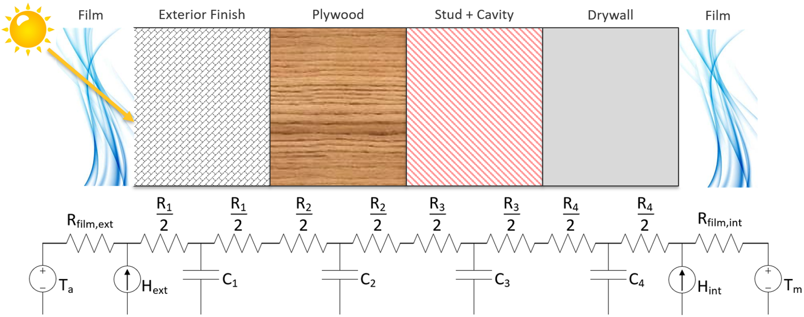
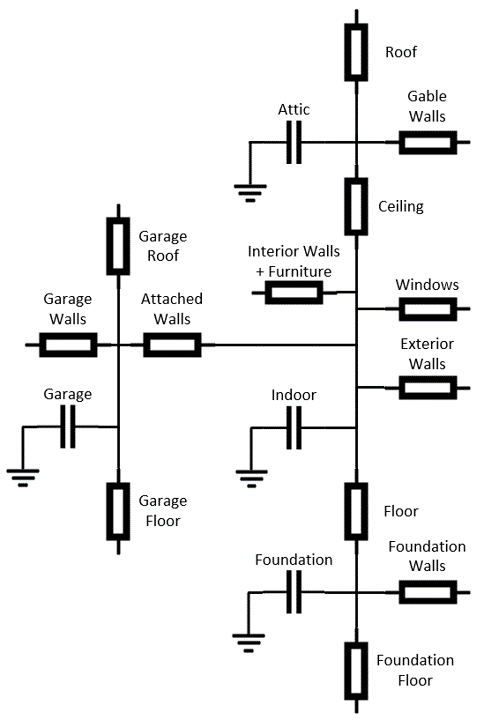
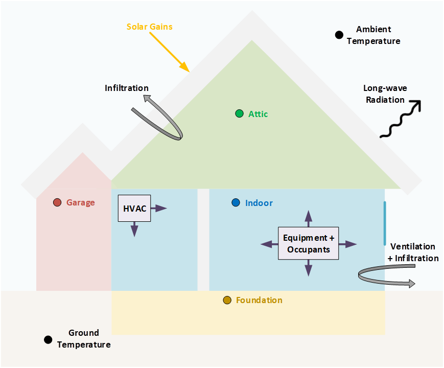

Modeling Approach
=================

Envelope
--------

The envelope model is a simplified resistor-capacitor (RC) model that
tracks temperatures throughout the dwelling. The model is flexible and
can handle multiple zones and boundaries, including:

-  Temperature Zones

   -  Living space

   -  Garage

   -  Attic

   -  Foundation (conditioned basement, unconditioned basement, or
      crawlspace)

-  Boundaries

   -  Exterior walls

   -  Interior walls and furniture

   -  Windows and doors to living space

   -  Roof (flat and tilted)

   -  Floor (slab or raised floor)

   -  Ceiling and gable walls (if attic exists)

   -  Garage walls, door, roof, and floor (if garage exists)

   -  Foundation walls, slab, ceiling, and rim joists (if foundation
      exists)

   -  Walls between adjacent units in multifamily buildings

Thermal resistance and capacitance coefficients are determined from the
HPXML file and are based on values from EnergyPlus input/output (.eio)
files.

Each boundary is modeled using a resistance/capacitance (RC) network.
OCHRE treats each individual material within the boundary separately,
with a capacitor representing the thermal mass of the material and
resistors with half of the overall material resistance on each side of
the capacitor. Convection, solar radiation, and thermal (long-wave)
radiation are accounted for at both surfaces of each boundary.
Convection is incorporated using constant film coefficients that are
based on the orientation of the surface and its location (interior or
exterior). Radiation is treated as heat added to the surface and is
calculated using the surface temperature, the temperature of other
surfaces in the connected zone, and view factors for each surface.
External surface radiation incorporates the ambient temperature and the
sky temperature. An example of how surfaces are split into a
corresponding RC network is shown below.

The full RC network for the building is generated dynamically depending
on what features are included in the building. The most basic example is
a single conditioned zone on a slab on grade with a flat roof, where
only a single zone is modeled. OCHRE will generate more complicated RC
networks if multiple zones are included in the building. Additional
zones are used to model attics, basements or crawlspaces, and garages.
The figures below shows the most complicated RC network in OCHRE, where
an attic, crawlspace/basement, and garage are all included in the
building, as well as a high-level overview of the heat transfer pathways
assumed in this case.

OCHRE includes the capability to model multifamily buildings using a
unit by unit based approach. Each unit is modeled as a separate dwelling
unit with adiabatic surfaces separating different units. OCHRE does not
currently support modeling a whole multifamily building with multiple
units simultaneously or the modeling of central space and water heating
systems.

Thermal mass due to furniture and interior partition walls is also
accounted for in the living space. Partition walls and furniture are
modeled explicitly with surface areas and material properties like any
other surface and exchange heat through both convection and radiation.
The heat capacity of the air is also modeled to determine the living
zone temperature. However, a multiplier is generally applied to this
capacitance. 
`Numerous studies <https://docs.google.com/spreadsheets/d/1ebSmvDFdXEXVRdvkzqMF1C9MwHrHCQKFF75QMkPgd7A/edit?pli=1#gid=0>`__
have shown that applying a multiplier to the air capacitance provides a
much better match to experimental data when trying to model explicit
cycling of the HVAC equipment conditioning the living space. This
multiplier helps account for the volume of ducts and the time required
for warm and cold air to diffuse through the living space. Values for
this multiplier in the literature range from 3-15 depending on the
study. OCHRE uses a default multiplier of 7.

The envelope includes a humidity model for the living space zone. The
model determines the indoor humidity and wet bulb temperature based on a
mass balance. Moisture can be added or removed from the space based on
airflow from outside through infiltration and ventilation, internal
latent gains from appliances such as dishwashers or cooking ranges, and
latent cooling provided by HVAC equipment. OCHRE does not currently
include a dehumidifier model to control indoor humidity.

Sensible and latent heat gains within the dwelling are taken from
multiple sources:

-  Conduction between zones and material layers

-  Convection and long-wave radiation from zone surfaces

-  Infiltration, mechanical ventilation, and natural ventilation

-  Solar irradiance, including absorbed and transmitted irradiance
   through windows

-  Occupancy and equipment heat gains

-  HVAC delivered heat, including duct losses and heat delivered to the
   basement zone

HVAC
----

OCHRE models several different types of heating, ventilation, and air
conditioning (HVAC) technologies commonly found in residential buildings in
the United States. This includes furnaces, boilers, electric resistance
baseboards, central air conditioners (ACs), room air conditioners, air source
heat pumps (ASHPs), and minisplit heat pumps (MSHPs). OCHRE also includes
“ideal” heating and cooling equipment models that perfectly maintain the
indoor setpoint temperature with a constant efficiency.

HVAC equipment use one of two algorithms to determine equipment max capacity
and efficiency:

-  Static: System max capacity and efficiency is set at
   initialization and does not change (e.g., Gas Furnace, Electric
   Baseboard).

-  Dynamic: System max capacity and efficiency varies based on indoor and
   outdoor temperatures and air flow rate using biquadratic formulas. These
   curves are based on “\ `Improved Modeling of Residential Air Conditioners
   and Heat Pumps for Energy Calculations
<https://scholar.colorado.edu/concern/graduate_thesis_or_dissertations/r781wg40j>`__\
” (e.g.,  Air Conditioner, Air Source Heat Pump).

In addition, HVAC equipment use one of two modes to determine real-time
capacity and power consumption:

-  Thermostatic mode: A thermostat control with a deadband is used to
   turn the equipment on and off. Capacity and power are zero or at their
   maximum values.

-  Ideal mode: Capacity is calculated at each time step to perfectly
   maintain the indoor setpoint temperature. Power is determined by the
   fraction of time that the equipment is on in various modes.

By default, most HVAC equipment operate in thermostatic mode for simulations
with a time resolution of less than 5 minutes. Otherwise, the ideal mode is
used. The only exceptions are variable speed equipment, which always operate
in ideal capacity mode.

Air source heat pumps, central air conditioners, and room air conditioners
include single-speed, two-speed, and variable speed options. Minisplit heat
pumps are always modeled as variable speed equipment.

The Air source heat pump and Minisplit heat pump models include heating and
cooling functionality. The heat pump heating model includes a few unique
features:

-  An electric resistance element with additional controls, including an
   offset thermostat deadband.
-  A heat pump shut off control when the outdoor air temperature is below a
   threshold.
-  A reverse cycle defrost algorithm that reduces heat pump efficiency and
   capacity at low temperatures.

All HVAC equipment can be externally controlled by updating the thermostat
setpoints and deadband or by direct load control (i.e., shut-off). Specific
speeds can be disabled in multi-speed equipment. Equipment capacity can also
be set directly or controlled using a maximum capacity fraction in ideal mode.
In thermostatic mode, duty cycle controls can determine the equipment state.
The equipment will follow the duty cycle control exactly while minimizing
cycling and temperature deviation from setpoint. 

Ducts
~~~~~

Ducts are modeled using a Distribution System Efficiency (DSE) based
approach. DSE values are calculated according to `ASHRAE
152 <https://webstore.ansi.org/standards/ashrae/ansiashrae1522004>`__
and represent the seasonal DSE in both heating and cooling. The DSE is
affected by the location, duct length, duct insulation, and airflow rate
through ducts. Sensible heat gains and losses associated with the ducts
do end up in the space the ducts are primarily located in and affect the
temperature of that zone. Changes in humidity in these zones due to duct
losses are not included.

For homes with a finished basement, this zone has a separate temperature
from the living zone and does not have it’s own thermostat. Instead, a
fixed fraction of the space heating/cooling to be delivered to the zone
is diverter into the basement. This approximates having dampers with a
fixed position in a home with a single thermostat. OCHRE currently
assumes a fixed 20% of space conditioning energy goes to a finished
basement.

Water Heating
-------------

OCHRE currently supports modeling tank, tankless and heat pump water
heaters. The water tank model is an RC model that tracks temperature
throughout the tank. It is a flexible model that can handle multiple
nodes in the water tank. Currently, a 12-node, 2-node, and 1-node model
are implemented. RC coefficients are derived from the properties file.
The fully mixed tank models the entire tank as a single node with a
uniform temperature. This model is best suited to large timesteps. In
residential waters, stratification occurs as cold water is brought into
the bottom of the tank and buoyancy drives the hottest water to the top
of the tank. The stratified tank model captures this buoyancy and the
effect it has on outlet temperature as well as the “dead volume” below
the lower element in an electric water heater that doesn’t get heated
during normal operation. Note that to model a heat pump water heater a
stratified tank model must be used (2 or 12 nodes, with 12 nodes
generally being more accurate but also more computationally intensive.
In HPWHs, the heat pump performance is a function of the ambient air wet
bulb temperature (calculated using the humidity module in OCHRE) and the
temperature of water adjacent to the condenser (typically the bottom
half of the tank in most products on the market today).

The tank model accounts for internal and external conduction, heat flows
from water draws, and includes an algorithm to simulate temperature
inversion mixing (ie stratification) if more than 1 node is used. The
model can handle regular and tempered water draws. A separate water draw
file is currently required to set the water draw profile. In standard
usage, this draw profile is part of the schedule file generated as part
of creating inputs (see the section on schedule inputs)

Mechanically, water heaters with a tank follow a similar structure to
HVAC equipment. For example, the Electric Resistance Water Heater has a
static capacity, while the Heat Pump Water Heater has a dynamic capacity
(and a backup electric resistance element similar to the Air Source Heat
Pump). Tankless water heaters operate similarly to Ideal HVAC equipment,
although an 8% derate is applied to the nominal efficiency of the unit
to account for cycling losses in accordance with ANSI/RESNET 301.

Similar to HVAC equipment, water heater equipment has a thermostat
control, and can be externally controlled by updating the thermostat
setpoints and deadband, specifying a duty cycle, or direct shut-off.
Tankless equipment can only be controlled through thermostat control and
direct-shut-off.

Electric Vehicles
-----------------

Electric vehicles are modeled using an event-based model and a charging
event dataset from
`EVI-Pro <https://www.nrel.gov/transportation/evi-pro.html>`__. EV
parking events are randomly generated using the EVI-Pro dataset for each
day of the simulation. One or more events may occur per day. Each event
has a prescribed start time, end time, and starting state-of-charge
(SOC). When the event starts, the EV will charge using a linear model
similar to the battery model described below.

Electric vehicles can be externally controlled through a delay signal or
a direct power signal. A delay signal will delay the start time of the
charging event. The direct power signal will set the charging power
directly at each time step, and it is only suggested for Level 2
charging.

Batteries
---------

The battery model incorporates standard battery parameters including
battery energy capacity, power capacity, and efficiency. The model
tracks battery SOC and maintains upper and lower SOC limits. It tracks
AC and DC power, and it reports losses as sensible heat to the building
envelope. It can also model self-discharge.

The battery model can optionally track internal battery temperature and
battery degradation. Battery temperature is modeling using a 1R-1C
thermal model and can use any envelope zone as the ambient temperature.
The battery degradation model tracks energy capacity degradation using
temperature and SOC data and a rainflow algorithm.

The battery model includes a schedule-based controller and a
self-consumption controller. The schedule-based controller runs a daily
charge and discharge schedule, where the user can define the charging
and discharging start times and power setpoints. The self-consumption
controller sets the battery power setpoint to the opposite of the house
net load (including PV) to achieve zero grid import and export. There is
also an option to only allow battery charging from PV. The battery will
follow these controls until the SOC limits are reached.

The battery can also be externally controlled through a direct setpoint
for real power. There is currently no reactive power control for the
battery model.

Solar PV
--------

Solar photovoltaics (PV) is modeled using PySAM, a python wrapper for
the System Advisory Model (SAM). Standard values are used for the PV
model, although the user can select the PV system capacity, the tilt
angle, and the orientation.

PV can be externally controlled through a direct setpoint for real and
reactive power. The user can define an inverter size and a minimum power
factor threshold to curtail real or reactive power. Watt- and
Var-priority modes are available.

Generators
----------

Gas generators and fuel cells can be modeled for resilience analysis.
These models include power capacity and efficiency parameters similar to
the battery model. Control options are also similar to the battery
model.

Other Loads
-----------

OCHRE includes many other common end-use loads that are modeled using a
load profile schedule. Load profiles, as well as sensible and latent
heat gain coefficients, are included in the input files. These loads can
be electric or natural gas loads. Schedule-based loads include:

-  Appliances (clothes washer, clothes dryer, dishwasher, refrigerator,
   cooking range)

-  Lighting (indoor, exterior, garage, basement)

-  Ceiling fan and ventilation fan

-  Pool Equipment (pool pump and heater, spa pump and heater)

-  Miscellaneous electric loads (television, other)

-  Miscellaneous gas loads (grill, fireplace, lighting)

These loads are not typically controlled, but they can be externally
controlled using a load fraction. For example, a user can set the load
fraction to zero to simulate an outage or a resilience use case.

Co-simulation
-------------

OCHRE is designed to be run in co-simulation with controllers, grid
models, aggregators, and other agents. The inputs and outputs of key
functions are designed to connect with these agents for streamlined
integration. These inputs and outputs are defined in [controller
integration] and [outputs and analysis], respectively.

See [citation and publication] for a list of use cases where OCHRE was
run in co-simulation. And feel free to contact the developers [contact]
if you are interested in developing your own use case.

Unsupported OS-HPXML Features
-----------------------------

While OCHRE is intended to work with OS-HPXML and files created through
either BEopt or ResStock, not every feature in those tools is currently
supported in OCHRE. Features not currently supported are generally lower
priority features that are considered future work. Depending on the
impact of the feature, OCHRE should either return a warning or error
when an HPXML file including these options is supplied. Warnings are
used if the option is likely to have a minimal impact on energy results
(such as eaves) and errors are used for a feature with a substantial
impact (such as a ground source heat pump). **Note that correctly
throwing warnings and errors is currently under development.** The
current list of technologies not supported in OCHRE is:

-  Eaves

-  Overhangs

-  Structural Insulated Panel (SIP) walls

-  Ground source heat pumps

-  Fuels other than electricity, natural gas, propane, or oil

   -  Propane and oil equipment are converted to natural gas

-  Dehumidifiers

-  Solar water heaters

-  Desuperheaters
